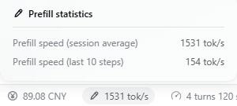
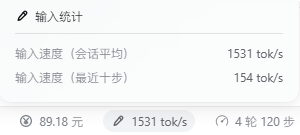

**dsh-prefill-speed-stats**: Show prefill speed directly in the status bar. 【For: deepseek-harness-v0.2.0-rc.2】

It adds one cell left of the shipped session-statistics strip, showing the session-average prefill
speed, and opens a two-row dialog with the session average and a last-N-steps window.



## Install

Two ways in. Both end with the same last step: **fully restart the app** — the browser bundle is
snapshotted when the boot graph is composed, so a page refresh is not enough.

**A. From npm** — nothing to clone:

1. Add the package to your DSH profile. DSH's plugin manager installs it by name (`Settings → Plugins`,
   or the `plugin_manager` agent tool), or run this inside `<dsh home>/profiles/<profile>`:

   ```sh
   pnpm add dsh-prefill-speed-stats@0.2.0-rc.2   # drop @… once a stable release exists
   ```

2. Check that the package name is listed in `dsh.profile.bundles` in that profile's `package.json`
   (installing through the plugin manager does this for you).
3. Restart the app.

**B. From this repository** — source, offline, or a version npm does not serve:

```sh
pwsh -File .\install.ps1               # Windows: link this checkout
sh ./install.sh                        # macOS / Linux
pwsh -File .\install.ps1 -From npm     # …or install the published package instead
pwsh -File .\install.ps1 -From npm -Ref 0.2.0-rc.2   # …pinned, as a prerelease-only release needs
```

The script performs steps 1–2 for you, backs up the manifest it edits, and prints step 3.

## What it shows

| Row | Value |
| --- | --- |
| dock cell | session-average prefill speed, in `tok/s` |
| `Prefill speed (session average)` | `Σ uncached prompt tokens ÷ Σ prefill windows` over the whole log |
| `Prefill speed (last N steps)` | the same ratio over the last (up to 10) measured steps — the label names the count it really averaged |

`uncached tokens` is `usage.inputTokens`: the part of the prompt the provider had to compute, where a
prefix-cache hit costs nothing. `prefill window` is `step/start` → first visible token. Steps that never
produced a visible token have no window, so they are excluded from both rows and reported as
`session.unmeasuredInputTokens` instead.

**A low reading usually means there was little new to compute, not that the model is slow.** A warm
step reads few uncached tokens while the fixed per-request latency (queueing, round trip, KV-cache
read) stays the same, so its figure collapses toward zero; the session average amortizes that fixed
part, the last-N window does not. The figure counts everything in the window, so it is a **lower bound**
on true prefill throughput.

## Files

| File | Role |
| --- | --- |
| `index.js` | Host half: registers the `sessionSpeed` projection |
| `lib/projection.js` | The fold, its schemas, and the two readings' operands |
| `lib/stream.js` | First-visible-token timing |
| `client.js` | Browser half: the dock cell, its dialog, styles and copy |
| `cordis.patch.yml` | Inserts the Host row the browser half attaches to |
| `test/` | Projection tests — `node --test test/projection.test.cjs` |
| `install.ps1` / `install.sh` | Install into a DSH profile — links this checkout, or `-From npm` for the published package |

## Notes

* The reading updates as the session grows; there is nothing to configure.
* Unknown events and malformed log records are ignored rather than fatal, so a future harness event can
  only cost accuracy, never the session.
* Unofficial plugin; it uses only public surfaces (the `sessionSpeed` Host projection and the
  `conversation.composer.dock` slot).

## License

MIT — see [LICENSE](LICENSE).

---

**dsh-prefill-speed-stats**：直接在状态栏显示 prefill 速度。【适用于：deepseek-harness-v0.2.0-rc.2】

位置在内置「会话统计」左边；点开可看会话平均与最近 N 步两个读数。



## 安装

两种方式，最后一步一样：**完全重启应用**——浏览器 bundle 在启动组合时快照，刷新页面不够。

**A. 从 npm 安装** —— 不用 clone：

1. 安装到 DSH profile：可以用 DSH 的插件管理器按包名安装（设置 → 插件，或 `plugin_manager` 工具），也可以在 `<DSH 主目录>/profiles/<profile>` 里执行：

   ```sh
   pnpm add dsh-prefill-speed-stats@0.2.0-rc.2   # 出了正式版就去掉 @… 部分
   ```

2. 确认该 profile `package.json` 的 `dsh.profile.bundles` 里有这个包名（用插件管理器装的话它会替你写）。
3. 重启应用。

**B. 从本仓库安装** —— 源码 / 离线 / npm 上没有的版本：

```sh
pwsh -File .\install.ps1               # Windows：链接当前克隆
sh ./install.sh                        # macOS / Linux
pwsh -File .\install.ps1 -From npm     # 也可以直接装 npm 上的已发布版本
pwsh -File .\install.ps1 -From npm -Ref 0.2.0-rc.2   # 只有预发布版时必须钉住版本
```

脚本会替你做完第 1–2 步（并备份它改过的 manifest），然后提示第 3 步。

## 显示内容

| 行 | 值 |
| --- | --- |
| 状态栏上的格子 | 会话平均输入速度，单位 `tok/s` |
| `输入速度（会话平均）` | 整个会话的 `Σ 未命中缓存 token ÷ Σ 预填充窗口` |
| `输入速度（最近 N 步）` | 同一算法，只统计最近（最多 10）个已测量步；标题会写出它真正平均了几步 |

`未命中缓存 token` 就是 `usage.inputTokens`：提供方真正需要计算的那部分提示词，命中前缀缓存的部分不计。`预填充窗口` 是 `step/start` → 首个可见 token。始终没产出可见 token 的步没有窗口，因此两个读数都不统计它，其 token 记在 `session.unmeasuredInputTokens` 里。

**读数低通常意味着「这次几乎没新东西要读」，而不是模型慢。** 缓存命中的步未命中 token 很少，而每次请求的固定开销（排队、往返、读 KV 缓存）不变，数字自然被压向零；会话平均把这些固定开销摊薄了，最近 N 步没有。由于窗口里的一切都计入分母，这个数字是真实预填充吞吐的**下界**。

## 文件

| 文件 | 作用 |
| --- | --- |
| `index.js` | 宿主半边：注册 `sessionSpeed` 投影 |
| `lib/projection.js` | 折叠逻辑、schema 与两个读数的算子 |
| `lib/stream.js` | 首个可见 token 的计时 |
| `client.js` | 浏览器半边：格子、面板、样式与文案 |
| `cordis.patch.yml` | 插入宿主行（浏览器半边挂在它上） |
| `test/` | 投影测试 —— `node --test test/projection.test.cjs` |
| `install.ps1` / `install.sh` | 装进 DSH profile（默认链接本地克隆，`-From npm` 装已发布版） |

## 说明

* 读数随会话增长自动更新，没有任何需要配置的项。
* 未知事件与畸形日志记录一律忽略而不致命，未来的 harness 事件最多损失精度，不会损坏会话。
* 非官方插件，只使用公开接口（`sessionSpeed` 宿主投影与 `conversation.composer.dock` 槽位）。

## 许可

MIT，见 [LICENSE](LICENSE)。
